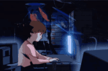

# WELCOME TO MY SPACE 👀
### About me:

Hi—I'm Yann, a student at FATEC Brasil. I'm a creative person passionate about GameDev and solving problems in a direct, inventive way. I'm currently transitioning into web development, learning modern technologies and applying my design sensibility and logical thinking to create interactive experiences.

  Oi sou Yann, estudante da <a href = "https://fateccarapicuiba.cps.sp.gov.br/">FATEC Carapicuíba</a>. Sou uma pessoa criativa apaixonada por GameDev e por resolver problemas de forma direta e inventiva. Atualmente estou migrando para a área de desenvolvimento web, buscando aprender tecnologias modernas e aplicar meu olhar de design e lógica para criar experiências interativas.

  
---

####  Formação:
- Estudante na FATEC Carapicuíba
#### Interesses:
- Game development, design criativo, UI, Cybersegurança
#### Objetivo atual: 
- Iniciar carreira em desenvolvimento web (front-end e fundamentos de back-end)

---

## Ferramentas & Tecnologias:

  
  
  
  
  
  
  

## Estou Aprendendo:
  
    

#### O que você encontrará aqui?

- Projetos de GameDev e protótipos interativos
- Pequenas aplicações web e learning projects
- Código limpo, experimentos e notas sobre aprendizado.
---

## Contatos:

   

